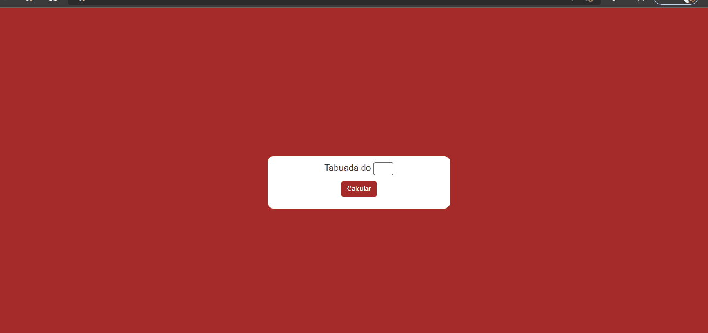
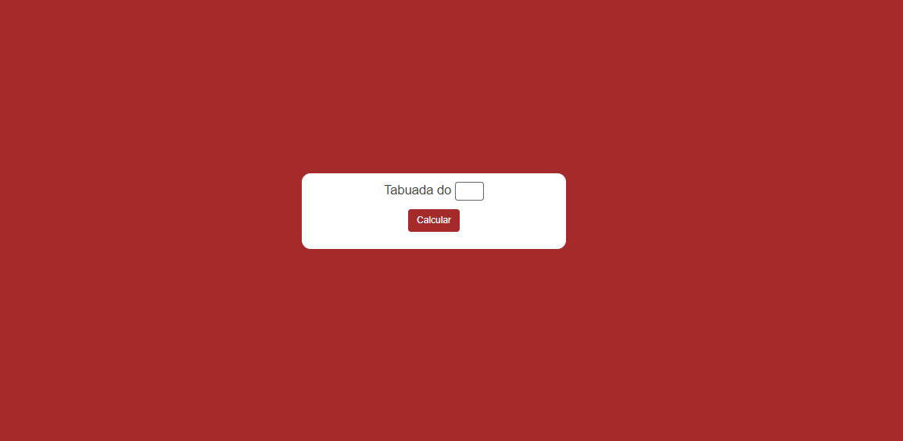

#### Aplicativo de Tabuada

#### Para usar você só precisa inserir um número de um a 12 para saber a tabuada do mesmo

#### Aprimorando meus conhecimentos em  JS e Lógica de Programação

#### Desafios trabalhar com manipulação do DOM

[]
[]

### Tecnologias utilizadas

  
  

   
   

[ ]